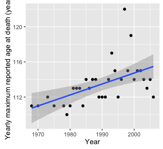
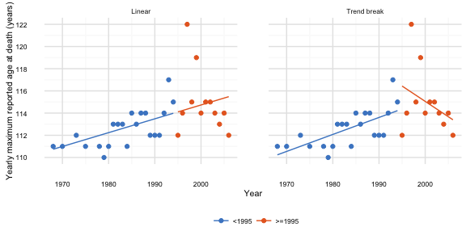
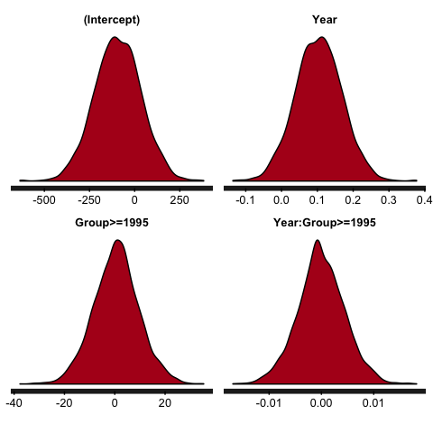
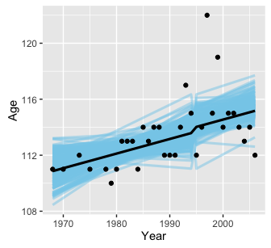
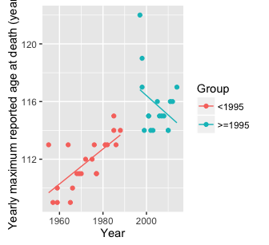
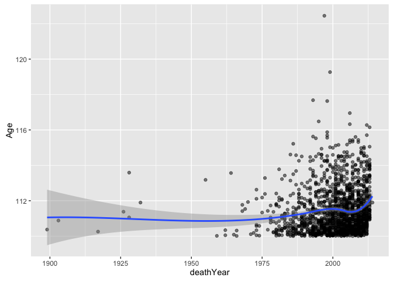
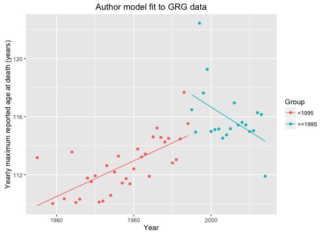

Unclear Evidence for a Limit to Human Lifespan
================
Philipp Berens and Tom Wallis
October 14, 2016

Dong et al. claim to present statistical evidence in favor of an absolute limit to the human lifespan. Here we present a reanalysis of central figures in their paper showing that (1) the main data of their paper does not provide evidence one way or another and (2) data analyzed in the Extended Data may be incomplete but completing it showed some evidence for their claims. Nevertheless, modeling maxima of distributions by assuming Gaussian noise makes inappropriate assumptions. A new analysis using extreme value theory is required to determine whether the data provide evidence for the authors' claims.

The model by the authors (Figure 2a)
====================================

The authors graph the maximum age reported at death (MRAD) for each year between 1968 and 2006. We acquired the data using WebPlotDigitizer and rounded the numbers to full years (which is what likely was the case for the original data). Originally the data came from the [IDL Database](http://www.supercentenarians.org/).

Here is the raw data, as presented by the authors, fitting separate regression for years up to 1994 and after 1995.

The plot shows the raw data points in black and separate linear fits with 95%-CIs for years before and after 1995. It is not clear from the paper why the authors chose 1995 as a point to separate models. In a [response](https://publons.com/review/480517/) to a critical review on publons, they provide an analysis with a segmented regression package, choosing 1998 as break point.

We can also obtain the statistics for this model by fitting a linear model with the additional group-variable as predictor including interactions, allowing for a changes slope and offset for the data after 1995.

``` r
mdl1 <- lm(Age~Year*Group,tbl)
summary.lm(mdl1)
```

    ## 
    ## Call:
    ## lm(formula = Age ~ Year * Group, data = tbl)
    ## 
    ## Residuals:
    ##     Min      1Q  Median      3Q     Max 
    ## -4.4359 -1.0757  0.0871  0.7616  6.1166 
    ## 
    ## Coefficients:
    ##                   Estimate Std. Error t value Pr(>|t|)  
    ## (Intercept)      -191.0734   116.0246  -1.647   0.1104  
    ## Year                0.1531     0.0585   2.617   0.0139 *
    ## Group>=1995       858.5757   347.1723   2.473   0.0195 *
    ## Year:Group>=1995   -0.4293     0.1737  -2.472   0.0196 *
    ## ---
    ## Signif. codes:  0 '***' 0.001 '**' 0.01 '*' 0.05 '.' 0.1 ' ' 1
    ## 
    ## Residual standard error: 1.956 on 29 degrees of freedom
    ## Multiple R-squared:  0.4163, Adjusted R-squared:  0.3559 
    ## F-statistic: 6.893 on 3 and 29 DF,  p-value: 0.001209

``` r
tbl2 <- tbl
tbl2$yhat <- predict(mdl1)

plt <- ggplot(tbl2, aes(x = Year, y = Age, colour = Group)) +
  geom_point() + 
  geom_line(aes(y = yhat)) + 
  ylab('Yearly maximum reported age at death (years)')

plt
```


Consistent with the paper, the fitted model has a slope of 0.153 years for years before 1995 and one of -0.276 for years afterwards (compare their Figure 2a). We also plot the regression line from this combined model to show that it is the same as the authors' separate regression fits.

A linear model
==============

A simple alternative hypothesis to the claim of the authors would be that MRAD actually keeps increasing and therefore, that there is no limit to human lifespan. We are agnostic as to whether or not this model makes plausible predictions (apparently people have argued both ways), but it does represent a simple comparison model:



The plots shows the raw data points again, with a linear regression with 95% CIs fitted to all the data.

``` r
mdl2 <- lm(Age~Year,tbl)
summary.lm(mdl2)
```

    ## 
    ## Call:
    ## lm(formula = Age ~ Year, data = tbl)
    ## 
    ## Residuals:
    ##     Min      1Q  Median      3Q     Max 
    ## -3.4791 -1.3544  0.0139  0.6343  7.6428 
    ## 
    ## Coefficients:
    ##               Estimate Std. Error t value Pr(>|t|)   
    ## (Intercept) -134.56615   69.84837  -1.927  0.06325 . 
    ## Year           0.12465    0.03511   3.550  0.00125 **
    ## ---
    ## Signif. codes:  0 '***' 0.001 '**' 0.01 '*' 0.05 '.' 0.1 ' ' 1
    ## 
    ## Residual standard error: 2.088 on 31 degrees of freedom
    ## Multiple R-squared:  0.2891, Adjusted R-squared:  0.2662 
    ## F-statistic: 12.61 on 1 and 31 DF,  p-value: 0.001251

In this case, MRAD increases slightly by 0.12 years per year.

Showing the models side-by-side
===============================

``` r
# prepare data:
tmp1 <- tbl
tmp2 <- tbl
tmp1$model <- "Trend break"
tmp1$yhat <- predict(mdl1)
tmp2$model <- "Linear"
tmp2$yhat <- predict(mdl2)

combined_data <- rbind(tmp1, tmp2)

plt <- ggplot(combined_data, aes(x = Year, y = Age, colour = Group)) + 
  facet_grid(~ model) + 
  geom_point() +
  geom_line(aes(y = yhat))

# appearance:
plt <- plt + 
  scale_y_continuous(name = "Yearly maximum reported age at death (years)",
                     breaks = seq(110, 126, by = 2)) + 
  ylab("Yearly maximum reported age at death (years)") +
  theme_minimal(base_size = 8) + 
  theme(panel.grid.major = element_line(colour = "grey90", size = 0.5)) + 
  theme(panel.margin = unit(2, "lines")) + 
  scale_color_manual(values = c("#4A87CB", "#E76826"), name = "") + 
  theme(legend.position = "bottom")

plt
```



``` r
#ggsave("combined_data_plot.pdf", width = 3.5, height = 3.2)
#ggsave("combined_data_plot.eps", width = 3.5, height = 3.2)
```

Model comparison
================

Which model is better? In the paper, the authors fail to provide evidence for their model, they seem to argue that the data looks like there is a saturation effect or a decline in MRAD after 1995.

One can do better and objectively compare the two fitted models. If we look at the output of the models above, the model by the authors explains a little more variance in the data than the linear model (0.42 vs. 0.29). On the other hand, the model also uses four parameters to do so, compared to only two in the linear model.

We can therefore ask if the increase in explained variance is "worth" the additional parameters. A number of model comparison metrics exist; in general these weigh the tradeoff between model fit and complexity differently. We present the results of several classical model comparison metrics below.

Classical ANOVA
---------------

First, we consider the two models as a nested set and compare them using classical ANOVA.

``` r
anova(mdl2, mdl1)
```

    ## Analysis of Variance Table
    ## 
    ## Model 1: Age ~ Year
    ## Model 2: Age ~ Year * Group
    ##   Res.Df    RSS Df Sum of Sq     F  Pr(>F)  
    ## 1     31 135.12                             
    ## 2     29 110.95  2    24.171 3.159 0.05739 .
    ## ---
    ## Signif. codes:  0 '***' 0.001 '**' 0.01 '*' 0.05 '.' 0.1 ' ' 1

The two extra degrees of freedom in the Dong et al model does not lead to a statistically-significant improvement in residual error over the simple linear model (following the traditional \(p < .05\) cutoff for significance).

AIC
---

Another comparison metric with appealing theoretical links to information theory (see Burnham & Anderson, 2002) is the so-called Akaike Information Criterion (AIC). In the AIC, smaller values denote better models.

``` r
AIC(mdl1)
```

    ## [1] 143.6636

``` r
AIC(mdl2)
```

    ## [1] 146.1678

Here, the model of Dong et al has the lower AIC and is thus the preferred model. However, following the heuristics suggested by Burnham & Anderson (2002, p.70), an AIC difference of -2.5 indicates that the data provide "substantial" support for the simpler linear model.

BIC
---

A related model comparison metric is the Bayesian Information Criterion (BIC), which is more conservative than AIC because it additionally penalises models with more parameters.

``` r
BIC(mdl1)
```

    ## [1] 151.1461

``` r
BIC(mdl2)
```

    ## [1] 150.6574

Following Raftery (1995), a BIC difference of 0.49 is not worth mentioning, providing no evidence of one versus the other model.

Bayes Factors
-------------

Finally, Bayes Factors (the ratio of the posterior model evidence), can be easily computed to compare simple linear models using the BayesFactor package (Morey & Rouder, 2015).

``` r
bf1 <- lmBF(Age~Year*Group, tbl)
bf2 <- lmBF(Age~Year, tbl)

bf1 / bf2
```

    ## Bayes factor analysis
    ## --------------
    ## [1] Year * Group : 1.242704 ±0.49%
    ## 
    ## Against denominator:
    ##   Age ~ Year 
    ## ---
    ## Bayes factor type: BFlinearModel, JZS

Under these default priors (assuming for example that both models are equally likely *a priori*), the models receive approximately equal support from the data (the Dong et al model is favoured with an odds ratio of 1.24-to-1).

Changing the priors of BayesFactor from "medium" to "ultrawide" on the standardised effect size scale did not appreciably affect these conclusions; with ultrawide effect-size priors the simpler model is now preferred with odds of 1.09-to-1.

Note that in the above mentioned [response](https://publons.com/review/480517/) the authors argue that the segmented regression model provides a better AIC than the linear model. We will add the segmented model here later.

Bayesian estimation of model parameters
---------------------------------------

Here we take a Bayesian approach to model estimation, and fit the full linear model including interaction terms. We employ a Student-t prior with a mean of zero, standard deviation of 2.5 and five degrees of freedom, which yields modest shrinkage of the coefficients towards zero, i.e. enforcing some conservatism in inference.

We fit the models using the package `rstanarm`, which allows relatively straightforward use of Bayesian methods.

``` r
bmdl <- stan_glm(Age~Year*Group, tbl, 
                 prior = student_t(5, 0, 2.5), 
                 prior_intercept = student_t(5, 0, 50),
                 family = gaussian(), 
                 adapt_delta = 0.99)
```

    ## 
    ## SAMPLING FOR MODEL 'continuous' NOW (CHAIN 1).
    ## 
    ## Chain 1, Iteration:    1 / 2000 [  0%]  (Warmup)
    ## Chain 1, Iteration:  200 / 2000 [ 10%]  (Warmup)
    ## Chain 1, Iteration:  400 / 2000 [ 20%]  (Warmup)
    ## Chain 1, Iteration:  600 / 2000 [ 30%]  (Warmup)
    ## Chain 1, Iteration:  800 / 2000 [ 40%]  (Warmup)
    ## Chain 1, Iteration: 1000 / 2000 [ 50%]  (Warmup)
    ## Chain 1, Iteration: 1001 / 2000 [ 50%]  (Sampling)
    ## Chain 1, Iteration: 1200 / 2000 [ 60%]  (Sampling)
    ## Chain 1, Iteration: 1400 / 2000 [ 70%]  (Sampling)
    ## Chain 1, Iteration: 1600 / 2000 [ 80%]  (Sampling)
    ## Chain 1, Iteration: 1800 / 2000 [ 90%]  (Sampling)
    ## Chain 1, Iteration: 2000 / 2000 [100%]  (Sampling)
    ##  Elapsed Time: 0.606 seconds (Warm-up)
    ##                0.589 seconds (Sampling)
    ##                1.195 seconds (Total)
    ## 
    ## 
    ## SAMPLING FOR MODEL 'continuous' NOW (CHAIN 2).
    ## 
    ## Chain 2, Iteration:    1 / 2000 [  0%]  (Warmup)
    ## Chain 2, Iteration:  200 / 2000 [ 10%]  (Warmup)
    ## Chain 2, Iteration:  400 / 2000 [ 20%]  (Warmup)
    ## Chain 2, Iteration:  600 / 2000 [ 30%]  (Warmup)
    ## Chain 2, Iteration:  800 / 2000 [ 40%]  (Warmup)
    ## Chain 2, Iteration: 1000 / 2000 [ 50%]  (Warmup)
    ## Chain 2, Iteration: 1001 / 2000 [ 50%]  (Sampling)
    ## Chain 2, Iteration: 1200 / 2000 [ 60%]  (Sampling)
    ## Chain 2, Iteration: 1400 / 2000 [ 70%]  (Sampling)
    ## Chain 2, Iteration: 1600 / 2000 [ 80%]  (Sampling)
    ## Chain 2, Iteration: 1800 / 2000 [ 90%]  (Sampling)
    ## Chain 2, Iteration: 2000 / 2000 [100%]  (Sampling)
    ##  Elapsed Time: 0.614 seconds (Warm-up)
    ##                0.436 seconds (Sampling)
    ##                1.05 seconds (Total)
    ## 
    ## 
    ## SAMPLING FOR MODEL 'continuous' NOW (CHAIN 3).
    ## 
    ## Chain 3, Iteration:    1 / 2000 [  0%]  (Warmup)
    ## Chain 3, Iteration:  200 / 2000 [ 10%]  (Warmup)
    ## Chain 3, Iteration:  400 / 2000 [ 20%]  (Warmup)
    ## Chain 3, Iteration:  600 / 2000 [ 30%]  (Warmup)
    ## Chain 3, Iteration:  800 / 2000 [ 40%]  (Warmup)
    ## Chain 3, Iteration: 1000 / 2000 [ 50%]  (Warmup)
    ## Chain 3, Iteration: 1001 / 2000 [ 50%]  (Sampling)
    ## Chain 3, Iteration: 1200 / 2000 [ 60%]  (Sampling)
    ## Chain 3, Iteration: 1400 / 2000 [ 70%]  (Sampling)
    ## Chain 3, Iteration: 1600 / 2000 [ 80%]  (Sampling)
    ## Chain 3, Iteration: 1800 / 2000 [ 90%]  (Sampling)
    ## Chain 3, Iteration: 2000 / 2000 [100%]  (Sampling)
    ##  Elapsed Time: 0.62 seconds (Warm-up)
    ##                0.54 seconds (Sampling)
    ##                1.16 seconds (Total)
    ## 
    ## 
    ## SAMPLING FOR MODEL 'continuous' NOW (CHAIN 4).
    ## 
    ## Chain 4, Iteration:    1 / 2000 [  0%]  (Warmup)
    ## Chain 4, Iteration:  200 / 2000 [ 10%]  (Warmup)
    ## Chain 4, Iteration:  400 / 2000 [ 20%]  (Warmup)
    ## Chain 4, Iteration:  600 / 2000 [ 30%]  (Warmup)
    ## Chain 4, Iteration:  800 / 2000 [ 40%]  (Warmup)
    ## Chain 4, Iteration: 1000 / 2000 [ 50%]  (Warmup)
    ## Chain 4, Iteration: 1001 / 2000 [ 50%]  (Sampling)
    ## Chain 4, Iteration: 1200 / 2000 [ 60%]  (Sampling)
    ## Chain 4, Iteration: 1400 / 2000 [ 70%]  (Sampling)
    ## Chain 4, Iteration: 1600 / 2000 [ 80%]  (Sampling)
    ## Chain 4, Iteration: 1800 / 2000 [ 90%]  (Sampling)
    ## Chain 4, Iteration: 2000 / 2000 [100%]  (Sampling)
    ##  Elapsed Time: 0.64 seconds (Warm-up)
    ##                0.621 seconds (Sampling)
    ##                1.261 seconds (Total)

We can summarize the fitted model and plot the posterior density over the parameters:

``` r
plot(bmdl,'dens')
```



``` r
bmdl
```

    ## stan_glm(formula = Age ~ Year * Group, family = gaussian(), data = tbl, 
    ##     prior = student_t(5, 0, 2.5), prior_intercept = student_t(5, 
    ##         0, 50), adapt_delta = 0.99)
    ## 
    ## Estimates:
    ##                  Median MAD_SD
    ## (Intercept)      -88.4  122.4 
    ## Year               0.1    0.1 
    ## Group>=1995        0.4    8.6 
    ## Year:Group>=1995   0.0    0.0 
    ## sigma              2.2    0.3 
    ## 
    ## Sample avg. posterior predictive 
    ## distribution of y (X = xbar):
    ##          Median MAD_SD
    ## mean_PPD 113.4    0.5 
    ## 
    ## Observations: 33  Number of unconstrained parameters: 5

Comparing the fitted model to the frequentist models above shows that the posterior median of the linear effect of Year (0.101) is similar to the estimated value above (0.153), but shrunken towards zero by the prior. The posterior density on the interaction term is centered around zero during inference, arguing that there is little evidence of a different slope after 1995. There is a small effect of the interaction term on the y-intercept, increasing the estimated y-intercept by 900. This is likely an artefact of the model parametrization.

``` r
draws <- as.data.frame(as.matrix(bmdl))
X <- draws[1:200,1:4]
foomdl <- mdl1
tbl2 <- tbl["Year"]

base <-ggplot(tbl, aes(x = Year, y = Age))
for (i in 1:200){
  foomdl$coefficients <- c(X[i,1], X[i,2], X[i,3], X[i,4]) 
  tbl2["Pred"] <- predict.lm(foomdl,tbl)
  
  base <- base + geom_line(data=tbl2,mapping = aes(x=Year, y=Pred), color="skyblue", alpha=0.5,size=1.1)
}

X = coef(bmdl)
foomdl$coefficients <- c(X[1], X[2], X[3], X[4]) 
tbl2["Pred"] <- predict.lm(foomdl,tbl)


base + 
  geom_point() + 
  geom_line(data=tbl2,mapping = aes(x=Year, y=Pred),size=1.1)
```



Extended data figure
====================

The authors present a similar dataset from an independent source, the Gerontological Research Group, in Extended Data Figure 6. They find similar results to those reported for the main analysis, and they argue that this provides independent evidence for their central analysis.

We again aquired these data using WebPlotDigitizer, and present them below.

    ## 
    ## Call:
    ## lm(formula = Age ~ Year * Group, data = ext_tbl)
    ## 
    ## Residuals:
    ##     Min      1Q  Median      3Q     Max 
    ## -2.5499 -1.0667 -0.2948  0.5918  5.1804 
    ## 
    ## Coefficients:
    ##                    Estimate Std. Error t value Pr(>|t|)   
    ## (Intercept)      -127.67958   71.86639  -1.777  0.08458 . 
    ## Year                0.12141    0.03644   3.332  0.00209 **
    ## Group>=1995       513.76598  169.13487   3.038  0.00456 **
    ## Year:Group>=1995   -0.25624    0.08462  -3.028  0.00467 **
    ## ---
    ## Signif. codes:  0 '***' 0.001 '**' 0.01 '*' 0.05 '.' 0.1 ' ' 1
    ## 
    ## Residual standard error: 1.66 on 34 degrees of freedom
    ## Multiple R-squared:  0.6694, Adjusted R-squared:  0.6402 
    ## F-statistic: 22.95 on 3 and 34 DF,  p-value: 2.654e-08



The fitted model has a slope of 0.121 years for years before 1995 (their slope = 0.1194) and one of -0.135 (their slope = -0.1367) for years afterwards (compare their Extended Data Figure 6). Differences to their model fit likely reflect data uncertainty from the digitisation process (owing to the poorer resolution of this figure in the paper).

    ## Analysis of Variance Table
    ## 
    ## Model 1: Age ~ Year
    ## Model 2: Age ~ Year * Group
    ##   Res.Df     RSS Df Sum of Sq      F   Pr(>F)   
    ## 1     36 123.789                                
    ## 2     34  93.689  2      30.1 5.4617 0.008772 **
    ## ---
    ## Signif. codes:  0 '***' 0.001 '**' 0.01 '*' 0.05 '.' 0.1 ' ' 1

    ## Bayes factor analysis
    ## --------------
    ## [1] Year * Group : 8.753882 ±0.92%
    ## 
    ## Against denominator:
    ##   Age ~ Year 
    ## ---
    ## Bayes factor type: BFlinearModel, JZS

Here, the ANOVA analysis does provide support for the Dong et al model. What about the other model comparison metrics? The AIC difference between the models is -6.6, which corresponds to "considerably less" support for the simple linear model relative to the authors' model. The BIC difference is -3.3, which provides "positive evidence" (Raftery, 1995) in support of the authors' model. Finally, the Bayes factor computed as above is about 8.8, which also provides positive support for the authors' model.

An important caveat for these data is that they are missing observations between 1989-1996. Since this data spans the key years of the "break", they could have an important influence on these conclusions. The Dong et al paper does not clarify why this data is missing from the authors' plot (compare to data table online [here](http://www.grg.org/Adams/A.HTM)).

Recovering missing data
=======================

In collaboration with [Adam Lenart](http://www.sdu.dk/staff/alenart), we recovered the full dataset from the Gerontology Research Group [website](http://www.grg.org/Adams/A.HTM), assuming that this was the source of the data the authors used. This is a dataset of "verified supercentenarians" as of January 1, 2014.

    ## [1] "English_United States.1252"

Here's all the data. The smoothing curve shows a local polynomial regression, and indicates an *upward* trend in age-at-death in recent years:

    ## Warning: Removed 64 rows containing non-finite values (stat_smooth).

    ## Warning: Removed 64 rows containing missing values (geom_point).



Now we can do the appropriate transformations and get the MRAD data. Note that unlike in their analysis, here we're not rounding to the nearest year.

``` r
grg_mrad <- grg %>% 
  select(-deathDatePX) %>% 
  rename(Year = deathYear) %>% 
  filter(Year >= 1950) %>% 
  group_by(Year) %>% 
  summarise(Age = max(Age)) %>% 
  mutate(Group = factor(Year>=1995, 
                        levels = c("FALSE", "TRUE"), 
                        labels = c("<1995", ">=1995")))
```

Here's a plot of that MRAD data:


There seem to be no shortage of datapoints between the years missing in the authors' plot. Note that the smooth indicates a downward trend in the maximum ages.

We can now fit and compare the two candidate models for this dataset.

``` r
grg_m1 <- lm(Age~Year*Group, grg_mrad)
summary.lm(grg_m1)
```

    ## 
    ## Call:
    ## lm(formula = Age ~ Year * Group, data = grg_mrad)
    ## 
    ## Residuals:
    ##     Min      1Q  Median      3Q     Max 
    ## -2.4173 -1.1761 -0.0075  0.6909  5.2793 
    ## 
    ## Coefficients:
    ##                    Estimate Std. Error t value Pr(>|t|)    
    ## (Intercept)      -131.51932   52.23287  -2.518   0.0151 *  
    ## Year                0.12348    0.02641   4.675 2.34e-05 ***
    ## Group>=1995       584.32020  132.66852   4.404 5.75e-05 ***
    ## Year:Group>=1995   -0.29154    0.06633  -4.396 5.92e-05 ***
    ## ---
    ## Signif. codes:  0 '***' 0.001 '**' 0.01 '*' 0.05 '.' 0.1 ' ' 1
    ## 
    ## Residual standard error: 1.569 on 49 degrees of freedom
    ## Multiple R-squared:  0.6291, Adjusted R-squared:  0.6064 
    ## F-statistic:  27.7 on 3 and 49 DF,  p-value: 1.274e-10

``` r
# additionally show that you get the same model fit from this combined regression:
blah <- grg_mrad
blah$yhat <- predict(grg_m1)

plt <- ggplot(blah, aes(x = Year, y = Age, colour = Group)) +
  geom_point() + 
  geom_line(aes(y = yhat)) + 
  ylab('Yearly maximum reported age at death (years)') + 
  ggtitle("Author model fit to GRG data")

plt
```



    ## 
    ## Call:
    ## lm(formula = Age ~ Year, data = grg_mrad)
    ## 
    ## Residuals:
    ##     Min      1Q  Median      3Q     Max 
    ## -4.7991 -1.1170 -0.2580  0.6088  7.5723 
    ## 
    ## Coefficients:
    ##              Estimate Std. Error t value Pr(>|t|)    
    ## (Intercept) -98.64102   31.84412  -3.098  0.00317 ** 
    ## Year          0.10692    0.01602   6.674 1.78e-08 ***
    ## ---
    ## Signif. codes:  0 '***' 0.001 '**' 0.01 '*' 0.05 '.' 0.1 ' ' 1
    ## 
    ## Residual standard error: 1.845 on 51 degrees of freedom
    ## Multiple R-squared:  0.4662, Adjusted R-squared:  0.4557 
    ## F-statistic: 44.54 on 1 and 51 DF,  p-value: 1.781e-08

    ## Analysis of Variance Table
    ## 
    ## Model 1: Age ~ Year
    ## Model 2: Age ~ Year * Group
    ##   Res.Df    RSS Df Sum of Sq      F    Pr(>F)    
    ## 1     51 173.57                                  
    ## 2     49 120.61  2    52.961 10.758 0.0001339 ***
    ## ---
    ## Signif. codes:  0 '***' 0.001 '**' 0.01 '*' 0.05 '.' 0.1 ' ' 1

    ## Bayes factor analysis
    ## --------------
    ## [1] Year * Group : 151.1302 ±0.97%
    ## 
    ## Against denominator:
    ##   Age ~ Year 
    ## ---
    ## Bayes factor type: BFlinearModel, JZS

Including the missing data from the table substantially increases support for the authors' model over a simple linear model. The ANOVA is highly significant; the AIC difference is -15, which corresponds to "essentially no" support for the simple linear model relative to the authors' model. The BIC difference is -11, which provides "very strong" (Raftery, 1995) support for the authors' model over the simple linear one. Finally, the Bayes factor computed as above is about 150, which also provides very strong positive support for the authors' model.

Conclusion
==========

The model comparison metrics presented here, using both Frequentist, information theoretic and Bayesian approaches, suggest that the main data reported in the paper provide no support for or against the idea that there is a limit to human lifespan. A simple linear model showing a positive relationship between year and lifespan is just as plausible given the data from Figure 2a. However, the data we recovered from GRG website do provide strong support for a segmented "trend-break" model over a linear one.

Nevertheless, there are deeper statistical issues regarding these models and the analysis presented by Dong et al. For example, it is questionable to model the extreme values of a distribution such as age-at-death by assuming linearity and Gaussian noise (Coles, 2001). Even if one accepts this as a valid modeling framework however, a model comparison like we performed here should have clearly been part of the Dong et al. paper.

References
==========

-   Burnham, K. P., & Anderson, D. R. (2002): Model selection and multimodel inference a practical information-theoretic approach. New York: Springer.

-   Coles, S. (2001): An introduction to statistical modeling of extreme values. London: Springer.

-   Kass, R. E., & Raftery, A. E. (1995). Bayes factors. Journal of the American Statistical Association, 90(430), 773–795.

-   Morey and Rouder (2015). BayesFactor: Computation of Bayes Factors for Common Designs. R package version 0.9.12-2. <https://CRAN.R-project.org/package=BayesFactor>

-   Raftery, A. E. (1995). Bayesian model selection in social research. Sociological Methodology, 111–163.

-   Vehtari, Gelman and Gabry (2016): Practical Bayesian model evaluation using leave-one-out cross-validation and WAIC, arxiv [link](https://arxiv.org/pdf/1507.04544v5.pdf)
